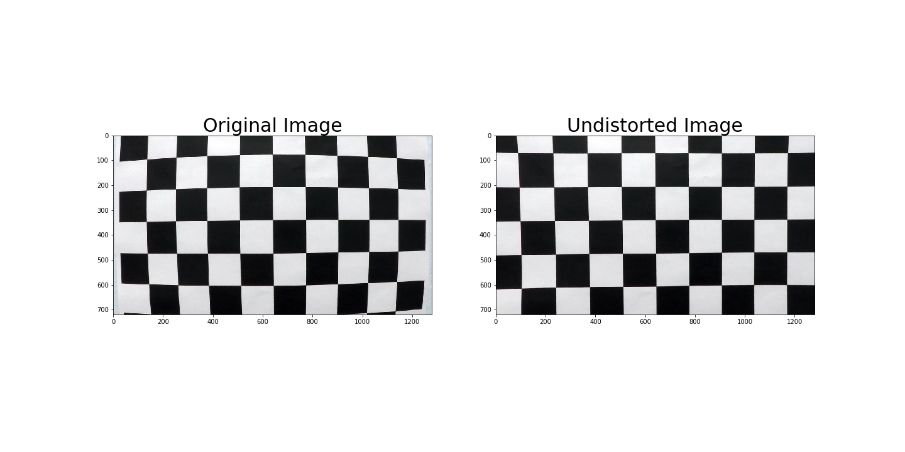
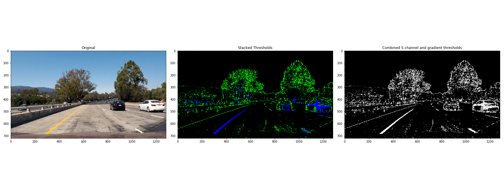
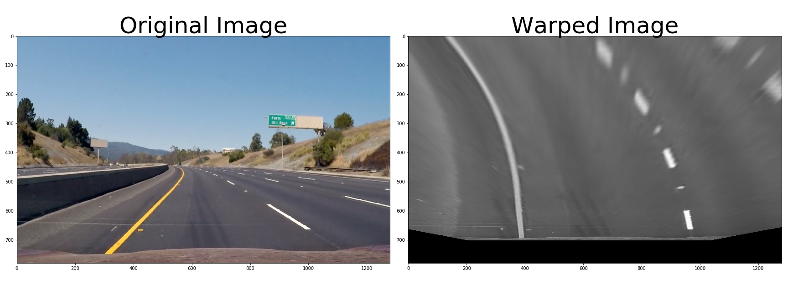
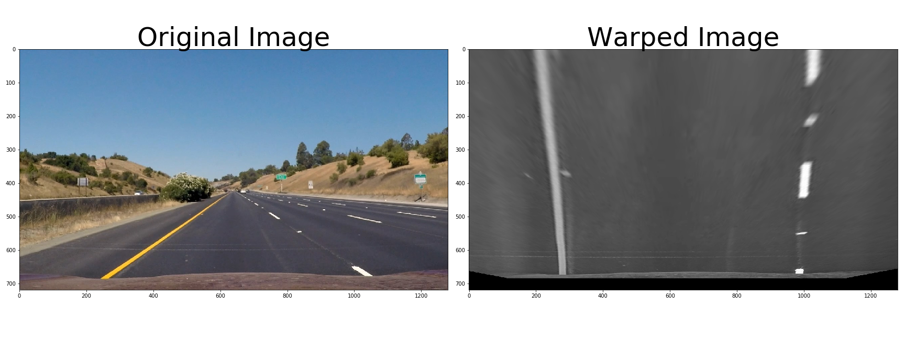
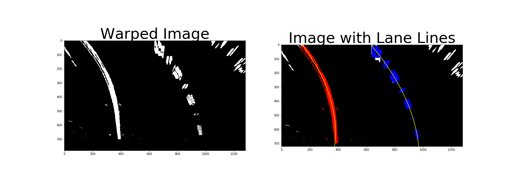
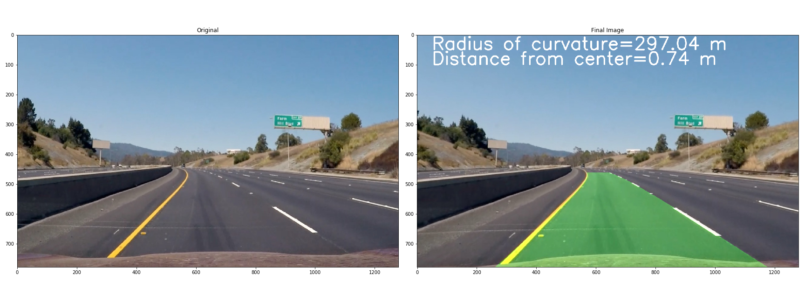
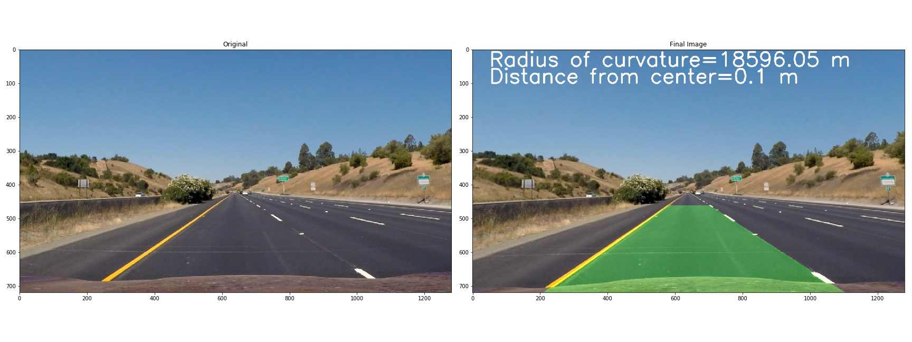
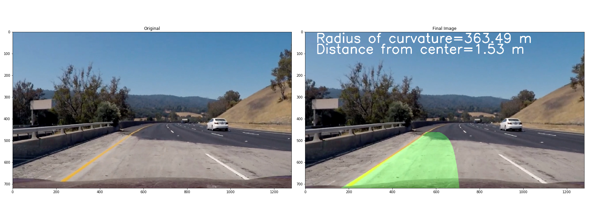

## Advanced Lane Finding

The Project
---

The goals / steps of this project are the following:

* Compute the camera calibration matrix and distortion coefficients given a set of chessboard images.
* Apply a distortion correction to raw images.
* Use color transforms, gradients, etc., to create a thresholded binary image.
* Apply a perspective transform to rectify binary image ("birds-eye view").
* Detect lane pixels and fit to find the lane boundary.
* Determine the curvature of the lane and vehicle position with respect to center.
* Warp the detected lane boundaries back onto the original image.
* Output visual display of the lane boundaries and numerical estimation of lane curvature and vehicle position.

## Files

Writeup of Report

[This file](README.md)

Source Code

[P4.ipynb](P4.ipynb)

Video Output(output_images folder)

1. [Output Video for Advance lane finding](lanes.mp4)

Image Outputs(output_images folder)

1. [Camera Calibration](./output_images/distortion_corrected.png)

2. [Binary Thresholded Image](./output_images/hsv_and_gradient.png)

3. [Perspective Transform Image 1](./output_images/warp.png)

4. [Perspective Transform Image 2](./output_images/warp2.png)

5. [Lane Lines Detected](./output_images/test7_lane_lines.png)

6. [Image with Lane Area Identified](./output_images/test7_color_fit_lines.png)

7. [Image with Lane Area Identified](./output_images/straight_lines1_color_fit_lines.png)

8. [Challenge with Shadows](./output_images/shadow_challenge.png)

## Camera Calibration and measuring Distortion 

1. For each source image provided in camera_cal
	+ Apply grayscale
	+ Use cv2.findChessboardCorners with 9x6 chessboard to find corners

2. Use calibrateCamera to compute the distortion matrix 

Code can be found in the cell 3 of [P4.ipynb](P4.ipynb)(Section title: Camera Calibration and measuring Distortion)

Example Image:

## Pipeline

### Using color spaces and gradients to produce a binary thresholded image
I used the code from the course material as such. The key steps are:

+ Start with undistorted image from the previous step

+ Detect lines Using Gradient in the X direction
Intuition: Vertical lines correspond to changes in x-intensities.
Apply Sobel, Normalize and Scale to range 0-255

+ Use HSL color space and S space in particular for binary thresholding
S-values are more robust than relying on RGB (yellow lines are very different from white lines)

+ Combine HSL binary image with Edges detected using Sobel

Parameters Used(Default):

HSL Binary Thresholding =(170, 255)

Sobel X Gradient Thresh=(20, 100)

Code can be found in the cell 4 of [P4.ipynb](P4.ipynb)(Section title:Using color spaces and gradients to produce a binary thresholded image)

Example Image:

### Applying Perspective transform

In my opinion, this is one of the key steps that differentiate the basic lane finding techniques(simple line detection e.g. using Canny and using slope to prune the results) 
from advance lane finding techniques.

Applying the right perspective just zooms into the area of interest from a top view and this helps the
lane line detection algorithm focus.

I realized after some experimentation that using chessboard images to automatically discover the correct 
perspective transformation did not work. So, I decided to go with manually identifying source and destination points.

Steps:

+ Pick an image that is relevant to lane identification instead of the chessboard images.
I used [this straight line test image](./test_images/straight_lines1.jpg)

+ Identify source points

+ Identify target points. These are corners of your image with a reasonable offset.

+ Use cv2.getPerspectiveTransform to obtain the perspective transformation matrix M and its inverse Minv.

+ Apply perspective transformation to the combined binary image from the previous step.

Main parameters:
X offset: 300
y offset: 100 

Code can be found in the cells 6,7 of [P4.ipynb](P4.ipynb)(Section title:Applying Perspective transform)

Example Images:

### Identifying Lane Lines and Polynomial Fitting

+ Identify the base of the line
To the binary output of the perspective tranformation, apply a histogram to identify lane lines with maximal lane points

+ Apply sliding windows starting from the base to search for lane points
If you have some history use the lane lines from past iterations to focus your search space instead of using a sliding window.

+ For each line, save all the lane points and fit a quadratic polynomial using np.polyfit

+ Extrapolate the lane points using the quadratic equation from base of image through top of the lane.

Code can be found in the cell 11 of [P4.ipynb](P4.ipynb)(Section title:Identifying Lane Lines and Polynomial Fitting)

Example Images:

### Measuring Radius of Curvature and Lane Offset
1. Curvature:
Used code from project.

Parameters: Following constants to convert pixels to real world distance

ym_per_pix = 30/720 # meters per pixel in y dimension
xm_per_pix = 3.7/700 # meters per pixel in x dimension
### Other Optimizations

2. Offset
+ Compute lane center and image center 
+ Compute distance between the two
+ Convert into real-world distance by applying the same x-scaling factor (3.7/700)

Code can be found in the cells 14 of [P4.ipynb](P4.ipynb)(Section title:Measuring Radius of Curvature and Lane Offset)

### Plotting Lane Area and putting it all together

Code can be found in the cells 17 of [P4.ipynb](P4.ipynb)(Section title:Plotting Lane Area and putting it all together)

Again, here I used the code from the lesson to plot the lane area.
Function draw_lane_area() does this and is found in Cell 17.

The overall pipeline is found in process_image() with the following key steps:

+ Undistort the image
+ Apply Color space and gradient techniques to undistored image to generate combined binary image
+ Apply Perspective Transform on combined binary image
+ Detect Lane line Points - lane_lines()
+ Use polyfit to fit lines and extrapolate
+ Use extrapolated points to compute radius of curvature
+ Compute offset

Example Images:

Video Output:

[Output Video for Advance lane finding](lanes.mp4)

### Challenges 

#### Some observations:
There are several new tricks I learned in this lesson. However, I think perspective transformation 
is the most important difference between the approaches in simple lane detection techniques
and advance lane detection techniques.

#### Some challenges:

+ Transition to/from shadows on the lane (example provided)
Problem: When applied to an isolated image, the approach struggles with shadows.
Solution: Using the previous images from the video can focus the search and result in better outcomes.

Example image:

+ Cars right ahead of you in your lane can add to the noise.
Cars directly ahead of us can probably cause some noise in the edge detection.
I wonder what would happen if we had bumper to bumper traffic across all lanes.

+ Missing lane lines for part of the road
If lane lines are missing for part of the road, this can be a challenge. In this case, it was a 
well marked highway and that did not happen.
Solution: Maintaining a cache of the lane lines from past images and averaging.

#### Some enhancements:

Sanity checking(to ignore bad outputs separately for left and right lanes) and smoothing.

ps: One question:
In the thresholding step, what is the intuition behind applying gradient/sobelx applied to L-values instead of S-values ?
